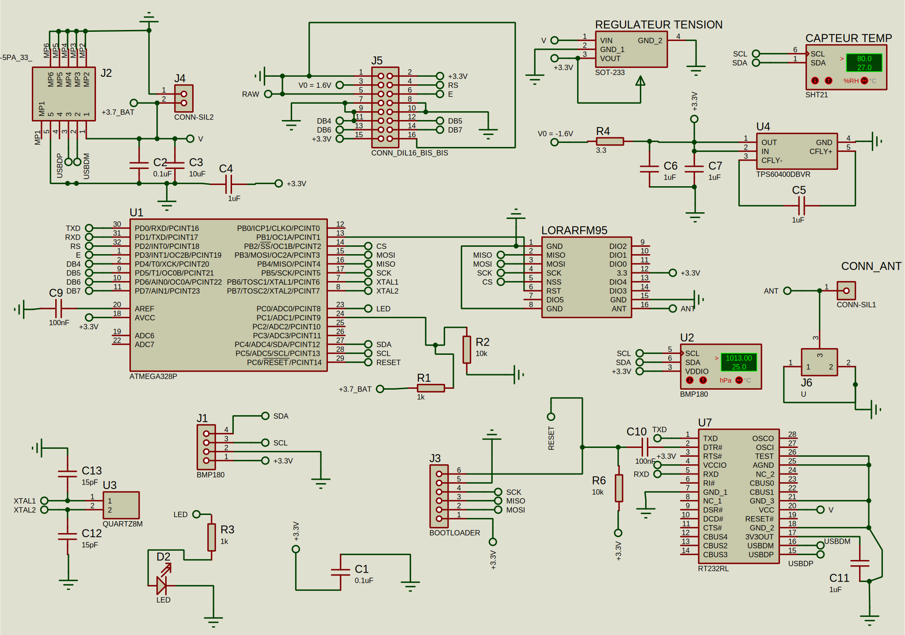
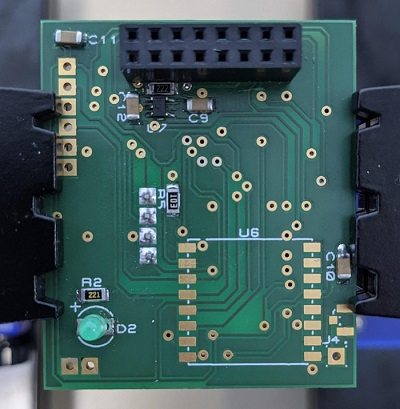
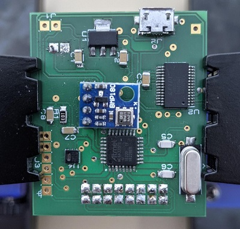
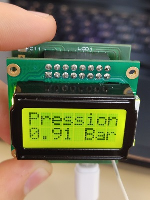
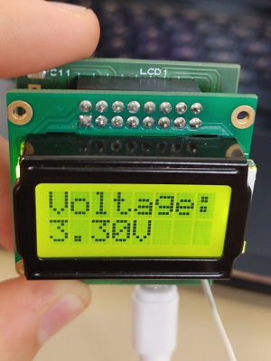
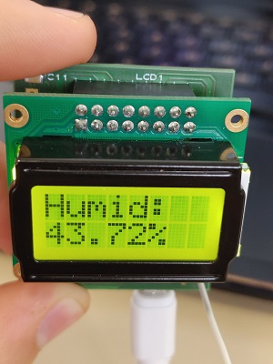
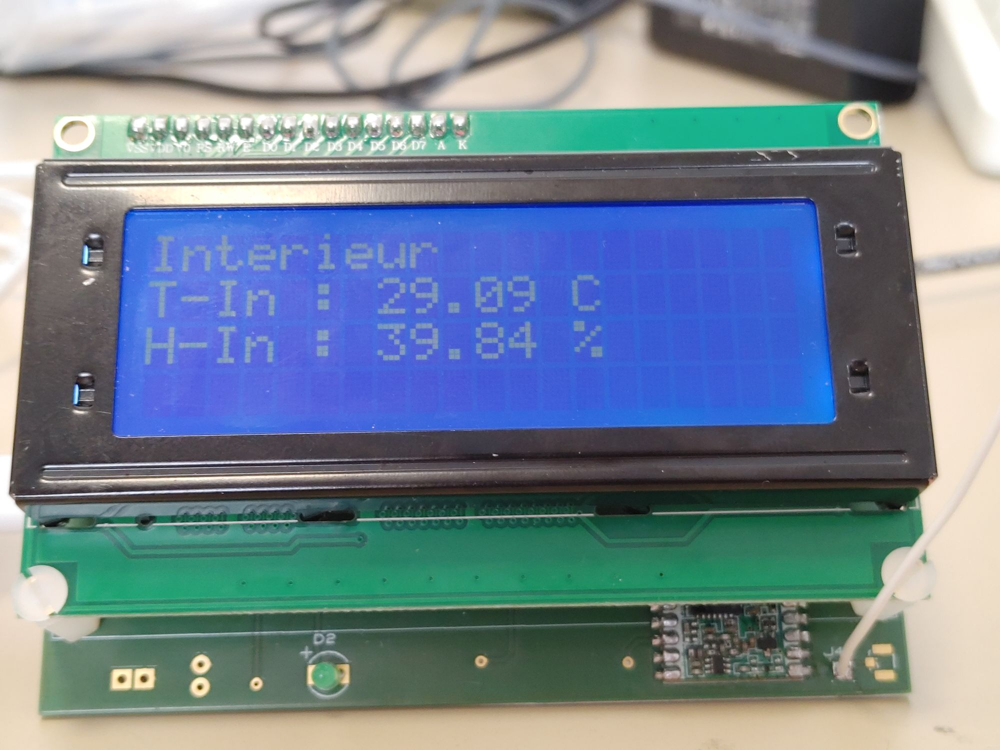
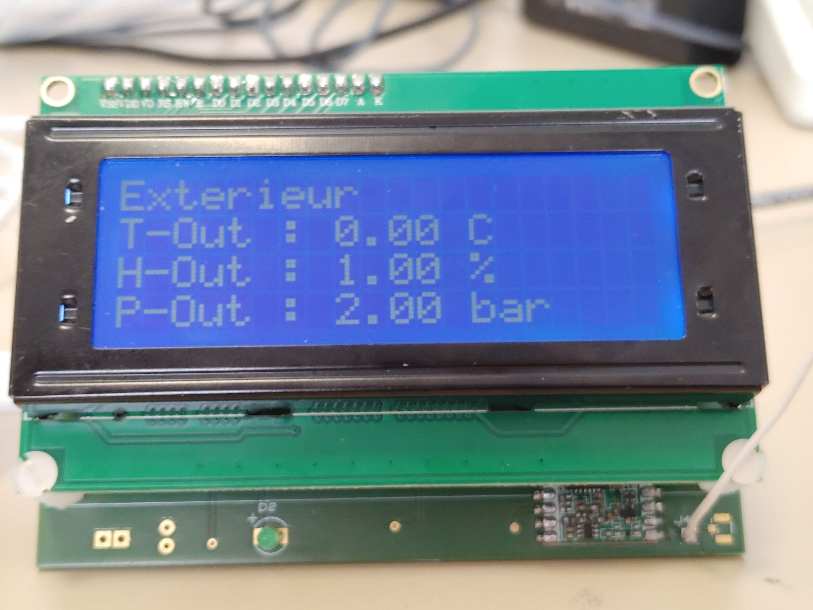

# Projet Station Météo 

Le projet est une station météo connectée.
Nous avons réalisé deux cartes électroniques qui constituent la station météo.
L'intégralité des ressources développées durant le projet sont disponibles sur le dépot GitHub suivant: https://github.com/Vidoux/Meteo_Station_ENSTA

## Introduction

- Carte Capteur :

Cette carte a pour rôle d'être positionnée en extérieur, elle prend les mesures d'hygrométrie, de température et de 
pression atmosphérique. Elle transmet toutes ces données à la seconde carte, la carte serveur, via un module de 
transmission LoRa.   

- Carte Serveur

Cette carte réceptionne tout d'abord les données de la carte capteur. Elle est également équipée d'un capteur de 
température et d'hygrométrie pour avoir ces données sur l'intérieur du local. Cette carte a également pour objectif 
de créer un serveur web sur un réseau local afin de publier les résultats des capteurs sur une page web.

Nous n'avons pas eu à réalisée cette carte, celle-ci a été conçue par les enseignants du module et nous a été livrée 
déjà soudée, prête à être utilisée.

## Schéma électrique et routage de la carte Capteur

À partir des spécifications techniques et des datasheet des composants, nous avons pu, dans un premier temps, 
réaliser le schéma électrique de la carte capteur.




Nous avons ensuite, toujours à l'aide de proteus, pu faire le routage de cette même carte. Après usinage de la carte 
et une séance de soudure, nous obtenons la carte suivante :




Nous avons par la suite pu charger le bootloader de la carte, permettant d'y télevrser notre programme, avant de 
terminer la soudure du capteur LoRa.

## Programmation du Serveur Web

La carte Serveur est équipée d'un microcontroller ESP32 qui est équipée d'une puce wifi.
On peut ainsi connecter notre carte sur un réseau wifi existant afin d'en faire un serveur web. En connaissant 
l'adresse ip de la carte sur le réseau, n'importe qui connecté sur le réseau peut alors se connecter sur la page 
hébergée par l'Arduino via son adresse IP. Si l'IP de la carte est "192.168.0.47" par exemple, on peut accéder à la 
page en entrant "http://192.168.0.47" dans la barre de recherche d'un navigateur.

Pour programmer le serveur, nous nous sommes inspirés de cette page internet :<br>
[https://tommydesrochers.com/controlez-votre-esp32-a-partir-dune-page-web-version-facile-esp32-ep3/](https://tommydesrochers.com/controlez-votre-esp32-a-partir-dune-page-web-version-facile-esp32-ep3/)

Le principe est d'abord de se connecter à un réseau wifi, pour cela on initialise le ssid et le mot de passe du 
réseau souhaité :

```C++
const char *ssid = "groupe8";
const char *password = "groupe8pswd";
```

De plus, la bibliothèque ```#include <WebServer.h>``` simplifie la création d'un serveur web.
La programmation de celui-ci est alors asser simple, on peut donc afficher les valeurs de tous les différents 
capteurs de toute la station. Le code de la page HTML hébergée par le serveur est mis à jour régulièrement (toutes 
les 4s) avec les nouvelles valeurs des capteurs.

## Récupération des données capteur

Pour récupérer les données capteurs, l'idée n'est pas d'utiliser les bibliothèques des fabricants, mais d'utiliser 
directement la communication en I2C et la manipulation des registres pour lire les valeurs de chaque capteur.
Nous avons ainsi essayé de regrouper toutes les fonctions de récupération des données des capteurs dans des 
librairies, chacune dédiées à un constructeur.
Pour cela nous sommes parties de la documentation arduino : https://docs.arduino.cc/learn/contributions/arduino-creating-library-guide

Nous avons donc deux librairies : Une pour les fonctions liées au capteur de pression BMP180 et l'autre dédiée au 
capteur SHT21. Afin d'utiliser ces deux librairies, les dossiers de celles ci doivent-être copiées dans le dossier 
"libraries" d'Arduino avant la compilation et le téléversement.
Chaque fonction des librairies est commentée. Ci-dessous un résumé des fonctions utiles pour le programme final:

BMP180:
```C++
int32_t getPressure();
void begin();
```
SHT21:
```C++
void begin();
float sht.getHumidity();
float sht.getTemperature();
```

De même pour le capteur Si7034, nous avons développé une librairie de fonctionnalité à partir de la datsheet du 
composant. Les fonctions publiques essentielles de cette bibliothèque sont les suivantes:
```C++
void begin();
bool queryDevice();
Si7034_Result fastMeasurement();
```

## Affichage des données sur les écrans LCD (20x4 et 8x2)

Pour l'affichage des données des capteurs, la carte capteur est équipée d'un écran 8x2, la carte serveur quant à 
elle est équipée d'un écran 20x4. Le principe de programmation est le même pour les deux écran, il y a simplement la 
taille qui change. Nous avons utilisé la bibliothèque arduino ```<LiquidCrystal.h>```.
Après avoir initialisé les pins de l'écran, on lance la communication avec l'écran:
```C++
lcd.begin(8,2);
```
On peut ensuite afficher les valeurs de nos capteurs avec la fonction 
```C++
lcd.print("...");
```

Nous avons enfin utilisés la fonction ```lcd.setCursor(0,1);``` afin de peaufiner notre affichage en choisissant 
précisément où nous voulions écrire sur l'écran. On utilise ensuite un système de pause avant de changer de donnée 
affichée. Nous pouvons ainsi faire tourner l'affichage pour afficher toutes les données.
Nous obtenons ainsi les affichages suivants :</br>




De même, sur la carte serveur :</br>



## LoRa et Transmission des données entre la carte Serveur et la Carte Capteur

## Guide d'implémentation du code

### Configuration de l'environnement

Tout d'abord, nous utilisons l'IDE arduino pour compiler et téléverser le code sur les cartes.
Après avoir téléchargé le code vous devez copier les dossiers suivants (les bibliothèques) :
- carte_serveur\libraries\Si7034
- carte_capteur\libraries\Bmp180
- carte_capteur\libraries\Sht21 </br>
Il faut ensuite les coller dans le dossier Documents\Arduino\libraries
Ainsi Arduino retrouvera les bibliothèques au moment de compiler le code.

### Carte capteur

Ouvrir le fichier carte_capteur.ino avec l'éditeur Arduino.
Modifier ensuite :
- le type de carte pour "Arduino Pro ou Pro Mini"
- le processeur pour "ATmega328P (3,3V, 8MHz)"
- le port pour correspondre au port sur lequel votre carte est branchée

On peut ensuite compiler le code et le téléverser vers la carte capteur.

### Carte Serveur

Pour la carte serveur, on modifie les paramètres suivants :

- le type de carte pour "DOIT ESP32 DEVKIT V1"
- la vitesse d'Upload pour "921600"
- la fréquence de Flash pour "80MHz"

On peut ensuite compiler et téléverser le code vers la carte serveur.


